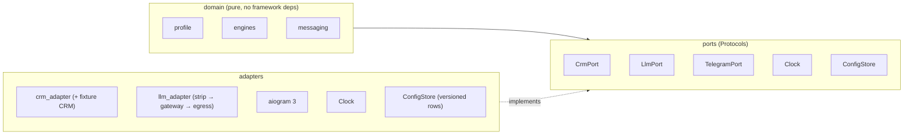
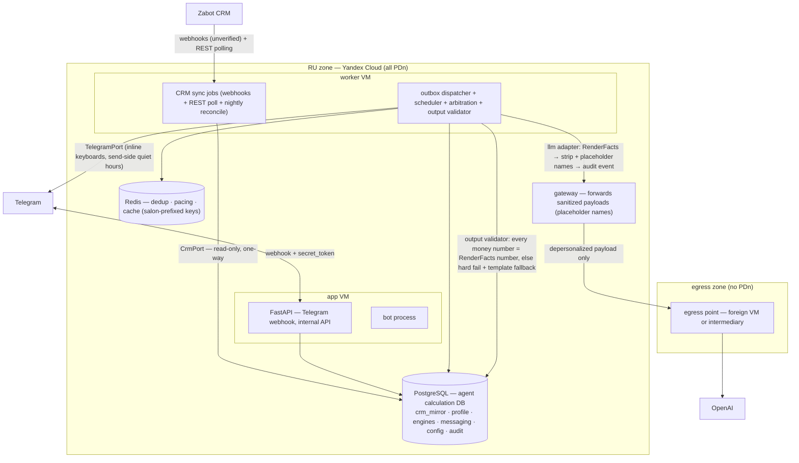
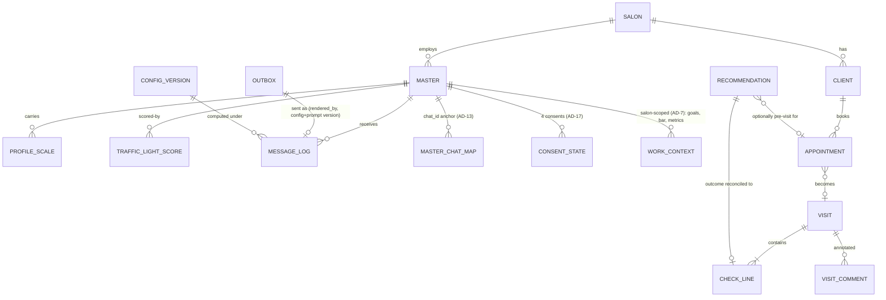

# Architecture Spine — Zabot AI Mentor, Stage 1

## Design Paradigm

**Hexagonal modular monolith.** One deployable, six modules, framework-agnostic domain. Two rules carry the whole shape:

- **Pipeline, not agent** — deterministic engines compute every number; the LLM narrates pre-computed facts, classifies inputs, and holds bounded coaching dialogue (AD-1). An **output validator** on the egress path hard-enforces the invariant: any mismatched money-type number blocks the send (AD-16).
- **Nothing external touches the domain** — every external system sits behind a port; every side effect with audit value goes through a durable record first (AD-2, AD-4). The agent owns its own calculation DB; CRM/Zabot is a read-only source (AD-3).



Module → schema → ownership:

| Module | Owns | Postgres schema |
| --- | --- | --- |
| `crm_sync` | webhook ingest (unverified) + REST polling + nightly reconcile, CRM mirror projections, ingestion-assigned surrogate IDs, erasure tombstones | `crm_mirror` |
| `profile` | master identity + `chat_id↔master_id` mapping, **psychological profile (master-level, not salon-scoped)**, scales, traffic-light **committed** state, **consent state (4 consents, AD-17)**, preference state, memory recency/archival policy, insistence counters, pause/opt-out state | `profile` |
| `engines` | scoring, income/forecast, recommendation, **adaptive bar logic (agent-calc-DB master, AD-3)**, shift-window derivation, business-KPI aggregation — pure compute over the agent calculation DB | `engines` |
| `messaging` | scheduler, outbox, dispatcher, arbitration, dialogue state, `RenderFacts`/`TriggerCandidate` contracts, **output validator (AD-16)**, owner-facing render (aggregate-only, psych-layer-inaccessible) | `messaging` |
| `llm` | prompt assembly from `RenderFacts`, depersonalization strip + **placeholder-name substitution (AD-5)**, `LlmPort` calls, template fallback, reverse-substitution re-personalization | (stateless — no schema; consumes `messaging` via its published interface) |
| `config` | insert-only versioned config + versioned prompt artifacts, editing boundary | `config` |
| cross-cutting | append-only audit | `audit` |

## Invariants & Rules

### AD-1 — Pipeline, not agent: three bounded LLM roles

- **Binds:** all modules; BRD §9.2, §10.2.1, §11.5, §15
- **Prevents:** LLM-authored money figures, scores, and rankings — hallucinated numbers violating the honesty contract; and the opposite failure, making the owner's 13.08 decision (LLM tone classification, §10.2.1) unimplementable
- **Rule:** The LLM has exactly three permitted roles: **(a) narrator** — rephrases pre-computed bound facts into psychotype-calibrated prose; **(b) structured-output classifier** — emits typed classifications (tone score 0–1 + confidence, barrier classification) that feed deterministic engines and never reach the master unvalidated; a classification below its config-set confidence threshold cannot change any state; **(c) bounded dialogue partner** — MI-style coaching, GROW options, onboarding, in-chat rehearsal under versioned prompts, where every figure remains a bound variable. Every figure (income, forecast, bar, %, score, ranking, cap count) is computed by a deterministic engine over the agent calculation DB (AD-3); the LLM may not emit a currency figure or metric it was not handed. The bound-variables contract is the **`RenderFacts`** Pydantic model owned by `messaging` (message class, pre-computed facts, fallback template); the `llm` module may not invent, derive, or round any field absent from it. **Hard enforcement is structural (AD-16 output validator) plus promptfoo golden tests in CI** covering numbers, register per motivational type, and ethics cases (no cross-master comparison, no guilt/threat language).

### AD-2 — All externals behind ports

- **Binds:** all modules
- **Prevents:** provider/vendor coupling leaking into domain logic; untestable time/timezone logic
- **Rule:** The domain defines `Protocol` interfaces — `CrmPort`, `LlmPort`, `TelegramPort`, `Clock`, `ConfigStore` — implemented by adapters, wired at the edge (FastAPI DI). No external call from the domain layer. `Clock` is injectable everywhere time is read. **`LlmPort` is a single port — provider swap happens behind it without domain rework** (owner-confirmed 23.08). Enforced in CI: import-linter forbids framework/adapter imports from `domain/`.

### AD-3 — CRM anti-corruption layer, agent calculation DB, webhook+poll+reconcile contract

- **Binds:** `crm_sync`, `engines`, `profile` (as consumers of the mirror)
- **Prevents:** Zabot/YClients field names, status enums, and semantics leaking into coaching engines; a dead system when the CRM surface answers change; dual-master data conflicts on derived values; the BRD §11.1 "two-way sync" fiction reaching the code
- **Rule:** The Mentor owns a canonical model — `Master`, `Client`, `Appointment`, `Visit`, `CheckLine`, `VisitComment` `[ASSUMPTION: entity set pending Zabot API field verification — OQ-1 narrowed]` — including visit comments (allergies, contraindications, complaints), which are a hard exclusion filter (§8.2) and recommendation signal (§8.1), synced with their own freshness class. The adapter translates CRM payloads (names, enums, timezones, money formats) at the boundary. `crm_sync` assigns stable surrogate IDs at first ingestion and publishes the natural-key mapping as part of its interface; downstream modules reference only surrogate IDs.
  **Sync contract (owner-confirmed 23.08):** primary channel = Zabot webhooks on events (booking created/changed, visit/check closed, cancellation) — **unverified, marked as such** pending API confirmation (OQ-1); REST API polling for entities without webhooks; safety net = **nightly full reconcile** to heal missed events. **Direction is strictly one-way: CRM/Zabot → agent, read-only.** No writes back to Zabot, no two-way sync (corrects BRD §11.1). A fixture CRM (recorded payloads behind `CrmPort`) doubles as the contract-test suite and keeps M0 unblocked.
  **Agent calculation DB (owner-confirmed 23.08):** the agent owns a separate calculation DB = a replica of the needed CRM/Zabot entities (the `crm_mirror` schema) + **all derived values** (metric dynamics, plan progress, adaptive bar, recommendation conversion, traffic-light score) in the `engines`/`profile` schemas. **CRM/Zabot is master of operational data + the 2 motivation plan types; the agent is master of all derived data.** Conflict is excluded by construction — the data sets do not overlap, each metric has exactly one owner. Stage 1 supports only the **2 Zabot plan types** (plan by master's average check, plan by total revenue); the 5-type scheme constructor (BRD §11.2) is **deferred to backlog** — no tier/rate/bonus config, no percent-base question, no rule engine at stage 1.

### AD-4 — Postgres is the durability backbone

- **Binds:** `messaging`, `crm_sync`, `llm`
- **Prevents:** dual-write loss (decide-to-message vs record-message), schedules dying with a Redis flush, divergent hand-rolled schedulers
- **Rule:** Every outbound side effect (Telegram send, LLM call, report) is written as an `outbox` row in the same transaction as the decision; a dispatcher sweeps due rows (`WHERE due_at <= now() AND status = 'pending'` with `FOR UPDATE SKIP LOCKED`) every 15–30 s. The outbox natural key is the originating decision row ID (1 decision row → ≤1 outbox row per channel); deferred rows carry an attempt count and max-defer lifetime ending in a terminal state — no ping-ponging forever. Redis holds only dedup keys, per-chat token buckets, and hot cache — never durable state; Redis keys are salon/master-canonical-ID-prefixed. `update_id` dedup in Redis is an optimization; the outbox natural-key idempotency is the guarantee.

### AD-5 — Two-zone data residency, placeholder-name egress, named depersonalization owner `[ADOPTED]`

- **Binds:** deployment, `llm`, logging, secrets; BRD §13.1 (owner decision 13.08.2026), 23.08.2026 confirmation
- **Prevents:** 152-ФЗ ч.5 ст.18 violation; per-caller depersonalization drift; unprovable-clean egress; raw identifiers leaking into prompts even in the depersonalized circuit; the mirror failure of messages that can never contain the master's name
- **Rule:** All PDn (profiles, screenings, correspondence, CRM mirror, message log) stays in the RU zone (Yandex Cloud). The **шлюз деперсонализации (depersonalization gateway)** is a named component: the strip step inside the `llm` adapter, **before the gateway**, applying a domain-side allowlist of egressible fields (versioned like config). **Direct identifiers must not enter prompts even in the depersonalized circuit (owner-confirmed 23.08):** the strip step replaces names/contacts/client names with **internal IDs + placeholder names** (e.g. `Master_A`, `Client_42`); a versioned placeholder map carries the substitution. The gateway forwards sanitized payloads through the egress point (own foreign VM or ruble-billed intermediary — OQ-6). Every egress call is an audit event (payload hash + allowlist version + placeholder-map version), and an egress contract test asserts no direct identifier and no raw name passes the strip point. The LLM generates against pseudonym/placeholder tokens; **final message assembly re-binds real names inside the RU zone after the LLM returns** (reverse substitution, same bound-variable mechanism as numbers, extended to identifiers). Cross-border transfer operates under art. 12 consent (AD-17 consent #4) + Roskomnadzor notification — both launch gates. Logs everywhere are PII-scrubbed; secrets live in Yandex Lockbox.

### AD-6 — Insert-only versioned config and prompts

- **Binds:** `config`, `engines`, `messaging`; BRD §5.2.1, §6.5, §10.2.1, §11.2
- **Prevents:** unreproducible decisions ("why did the bot say that"), mid-message config drift, UPDATE-based rollback, and an income engine with no scheme taxonomy to compute against
- **Rule:** All business parameters — quiet hours, frequency caps **and** floors, trigger offsets (T-24h/T-2h, pre-visit 30–60 min), **the 2 Zabot plan types only (avg-check, total-revenue; the 5-type constructor is backlog — AD-3)**, salon priorities and **stop-list**, pay period, refusal-pause N, freshness tiers and hard limits, composite-score weights, tone-confidence thresholds, hysteresis entry/exit + **calibration guidance (false reds ≤1/10 masters/month, missed burnouts = 0 — on doubt lean yellow not green, yellow↔green ≤1/week per master)**, per-scale smoothing α, shift-window definition, **adaptive bar corridor (±15% deviation from calculated bar, +10%/period raise step, −15% tactical-lower floor, not below master's 2-period actual average, bar cannot exceed the Zabot plan)**, **progress thresholds (+5% key metric OR ≥95% bar retention over 2-week window at ≥80% load)**, **type-divergence delta (+15 points out of 100, ≥2 pay periods)**, pause threshold (no shifts ≥ N days, starting N=5) — live in immutable rows `(version, params JSONB, author, created_at, valid_from)`, Pydantic-validated at the editing boundary. Prompt templates and screening instruments are versioned artifacts in the same store. Every outbound message row stores the **(config_version, prompt_version)** under which every embedded figure was computed, referencing the originating score/recommendation rows (provenance chain); the dispatcher passes the config_version into engine calls so compute and send never span versions. Engines read config by version at decision time; activating a prior version is a new row; config changes are audit events. **Ruble calculation gate (owner-confirmed 23.08):** ruble income forecasts are enabled **only if the owner has entered remuneration rules in the agent settings** (stored in the agent calc DB); otherwise the agent works in metric + plan-progress terms ("240 ₽/visit left to the avg-check plan" — plan-relative, not salary); any ruble figure is explicitly labeled a service estimate, not Zabot data. **Config-completeness degradation (§11.2):** a semantically incomplete plan/config suppresses monetary figures (metrics only) and emits an owner-clarification request — a third degradation mode alongside AD-9's freshness ladder.

### AD-7 — Salon-scoped tenancy, psych-layer isolation, master-in-two-salons `[ADOPTED + amended 23.08]`

- **Binds:** all domain schemas, all Redis keys, owner-facing render
- **Prevents:** a schema rewrite when the role model extends; the owner seeing the psychological layer (scales, tone, correspondence, traffic-light status) — a master-trust failure that breaks honest screening answers; a master's psych profile leaking across salons to either owner; an admin-role retrofit becoming a permissions rewrite
- **Rule:** Every domain row carries a salon key; all queries are salon-scoped; Redis keys carry the salon (or canonical master) prefix. Cross-salon access is impossible by construction at the query layer, whatever role model lands. **Psychological-layer isolation (owner-confirmed 23.08):** the psychological layer — profile scales, tone, master↔AI correspondence, traffic-light status + history — is **inaccessible to the owner**, enforced at the query layer AND the owner-facing render boundary. Owner-visible psych data is limited to: the red-escalation fact + the "share of green weeks" aggregate in the period report. **Master-in-two-salons data model:** ONE psychological profile (motivational type + scales — a property of the person, NOT the salon, stored at master level) + TWO independent work contexts (salon-scoped: goals, bar, metrics, recommendations, reports). The AI always explicitly identifies which salon it is discussing. Because the psych profile is disclosed to no owner, its shared nature creates no conflict of interest. **Role extensibility:** the role/permissions model must allow adding a "salon administrator" role later without reworking access rights (role table extensible, permissions matrix not hardcoded to master/owner).

### AD-8 — UTC in the DB, dual local time at the decision point

- **Binds:** `messaging`, `crm_sync`, `engines`, `profile`
- **Prevents:** quiet-hours and pre-visit messages firing at the wrong local time across RU's 11 static zones; shift caps counted against different windows by different modules; a master whose home TZ differs from the salon's getting 23:00 messages
- **Rule:** All timestamps stored as UTC `timestamptz`. **Store BOTH salon TZ and master TZ** (master TZ defaults to salon TZ, overridable per master — owner-confirmed 23.08). **Quiet hours (default 21:00–9:00, BRD §7.3) and ALL personal sends to the master — evaluated in MASTER TZ** at send-decision time. **Pre-visit offsets (30–60 min, BRD §9.2) — evaluated in SALON TZ** (where the visit physically occurs). **The two compose, they don't conflict:** the pre-visit *target window* is computed in salon TZ (when the visit is), but the *send decision* is still gated by master-TZ quiet hours (AD-10) — a pre-visit whose salon-TZ window falls inside the master's quiet hours is deferred to the next master-TZ window, never sent at 06:30 master-TZ just because it's 09:30 salon-TZ. Shift-window derivation is owned by `engines` (pure compute, consumed via interface) using salon TZ (shifts are salon-scheduled) with the definition pinned in config — the dispatcher's ≤5/shift cap and reporting totals use the same window. Quiet hours are never baked into a job's fire time; they are a send-decision gate (AD-10).

### AD-9 — Freshness tiers, two clocks, and the two-way degradation ladder

- **Binds:** `crm_sync`, `engines`, `messaging`; BRD §5.2.1 `[ADOPTED + amended 23.08]`
- **Prevents:** each engine inventing its own stale-data behavior; dishonest narratives during CRM outage; stale-mirror praise or wrongful suppression during recovery
- **Rule:** Every mirror row carries two timestamps: `source_event_at` (CRM-side truth) and `synced_at` (mentor-side fetch). **Freshness tiers read `synced_at`** — checks/sales ≤ 60 min, schedule/appointments ≤ 15 min, dynamics/period totals ≤ 24 h — three SLOs, alerted per class. **`suppress_backdated_events` reads `source_event_at`.** Level 1 (older than tier, younger than hard limit — checks 24 h, schedule end-of-current-day): data used with a visible timestamp label; monetary forecasts suppressed. Level 2 (older than hard limit or CRM down): communication continues without figures; money math, visit-specific praise, and forecasts suspended; master told honestly. Post-recovery: resync, recompute totals; missed event messages are **never** sent retroactively — folded into shift/period totals — **with one exception (owner-confirmed 23.08): praise for a successful recommendation may be sent late, within 60 min but no later than the end of the same shift; this is the most valuable reinforcing message, better late than never.** **Absence ≠ staleness:** cold-start (new master/salon/client, no CRM history) uses config-defined priors per entity — conservative bars from defaults, category/seasonality priors for new clients — never blocks onboarding.

### AD-10 — Dispatcher owns arbitration, pacing, floors, consent gates, and send-side quiet hours

- **Binds:** `messaging`; BRD §7.3, §9.4, §12, §15
- **Prevents:** per-module spam/arbitration logic drifting apart; the "money" class disabled first under pressure; automated force/sprint triggers bypassing the GROW consent gate; insistence past the master's "no"; quiet-hours treated as best-effort; the master unable to actually stop communication
- **Rule:** Engines publish a **`TriggerCandidate`** (message class, expected income, deadline, source-data timestamps) — the dispatcher's only ranking input. Competing triggers resolve by expected-income priority per master per decision window; losers deferred (AD-4 deferral caps) or merged. Hard caps (≤5 initiative messages/shift, ≤2 on days off, lower on yellow/red, BRD §7.3) and the message-class disable ladder (period totals and pre-visit recommendations disabled **last**) are enforced in the dispatcher. Telegram pacing (~1 msg/s per chat) via per-`chat_id` token buckets in Redis. **Quiet hours are GUARANTEED on the send side (owner-confirmed 23.08): the dispatcher simply does not send in the interval — not best-effort.** **Telegram inline keyboards MUST be used for screenings (1–5 button scale) and quick replies** — reduces friction, raises answer share, no separate widget needed. **Force/sprint triggers pass through the §9.4 GROW consent gate** — never auto-initiated. The master's explicit request ("write less often") applies immediately, is owned by `profile` (consent-adjacent, audited), and overrides model inferences; ignore rate ≥70% over 2 weeks → drop to minimum and ask once about preferred format. **Insistence rule (§15):** per-topic offer counters live in `profile`; a persistent proposal is made at most twice, then fixed in the profile and dispatcher-suppressed. Message rows record `rendered_by: llm|template|validator-fallback`. LLM cost controls live in the `llm` adapter: response length caps, per-master daily token meter, budget-trip template fallback. Owner-facing rendering (period reports §14 and red-status escalation §10.3) enforces aggregate-only/no-quotes + psych-layer-inaccessible (AD-7) at this boundary. **Communication floor (owner-confirmed 23.08):** 1 period-summary message + reactive answers to incoming (reactive mode always available); pre-visit recommendations disabled LAST and only on explicit master request. **Pause/vacation mode:** automatic pause when no shifts scheduled ≥ N days (starting N=5, config-defined); manual pause ("I'm on vacation until..."); during pause, silence except reactive answers; goals/bar logic accounts for the pause. **Full opt-out:** the master can disable the service entirely, degrading to legally required notices only; the owner sees only the fact "master disabled the assistant" — no reasons, no details; equals consent withdrawal in effect (AD-17).

### AD-11 — Modular monolith boundaries and the inter-module contracts

- **Binds:** repo structure, all modules
- **Prevents:** a distributed monolith's ops tax now, an unextractable ball of mud later — and the `llm`/`messaging` integration deadlock where each team complies yet can't integrate
- **Rule:** One deployable. Cross-module calls only through each module's published interface; zero shared-table access across modules (`llm` is stateless and consumes `messaging` solely via its interface — the `RenderFacts` and `TriggerCandidate` models are that interface's contract; the output validator (AD-16) is owned by `messaging` and consumes `RenderFacts`); one Postgres schema per module plus append-only `audit`. Enforced in CI: import-linter module boundaries + a schema-ownership check on migrations. No microservices, no message broker as source of truth, no K8s at stage 1 (SKIP LOCKED keeps N workers possible).

### AD-12 — At-least-once everywhere, with owned key namespaces

- **Binds:** `messaging`, `crm_sync`
- **Prevents:** double sends, double counting on redelivery, and reconciliation corruption when the CRM re-keys edited rows (OQ-1 leaves ID stability open)
- **Rule:** Telegram handlers dedup on `update_id`; outbox sends and sync upserts are idempotent by natural key. Natural-key namespaces are defined per entity by `crm_sync` and published with its interface; downstream reconciliation references ingestion-assigned surrogate IDs (AD-3) — a re-keyed source row maps to the same surrogate. The nightly full reconcile (AD-3) is idempotent by natural key. Recommendation-outcome reconciliation (check contents only, never asking the master) is idempotent per visit.

### AD-13 — One canonical master identity, one owner of the anchor mapping

- **Binds:** `profile`, `messaging`, `crm_sync`, `engines`
- **Prevents:** caps, arbitration, and consent counted against one key while sends execute against another (double sends, caps bypassed across two chat_ids — a consent-integrity failure under 152-ФЗ); a master-in-two-salons being modeled as two people (split psych profile) or one work context (cross-salon leakage)
- **Rule:** There is exactly one canonical internal `master_id` (owned by `profile`). Every cross-module reference — outbox rows, engine scores, dedup keys, Redis keys, audit events — carries the canonical ID. The `chat_id ↔ master_id` mapping table is owned by `profile`, which also defines merge/split behavior when a master changes Telegram account, links a second account, or is re-created in the CRM. **The psychological profile (type, scales) hangs off `master_id`, not off a salon-scoped row (AD-7); work contexts are salon-scoped rows keyed by (`master_id`, `salon_id`).**

### AD-14 — Single-owner state mutation

- **Binds:** `profile`, `engines`, `messaging`
- **Prevents:** hysteresis applied twice or zero times; the dispatcher pacing against a stale or uncommitted traffic-light color (full-rate messaging to a red master); consent state and psych scales drifting from the records that gate egress
- **Rule:** Every stateful entity has exactly one owning module, mutated through one named path. Traffic light: `engines` publish score + recommended transition (pure compute); `profile` applies hysteresis and owns the **committed** color; the dispatcher reads the committed color via `profile`'s interface at decision time — never a cached engine inference. The same rule governs scales (profile owns smoothing updates; engines only read), consent/preference state (profile — AD-17), and pause/opt-out state (profile). **Consent revocation re-weights the traffic-light composite score in `engines`** (e.g. consent #2 withdrawn → screenings/tone stream drops out, CRM-signal-only weights apply) — the re-weighting rule is config-owned, the consent state is profile-owned.

### AD-15 — Erasure propagates everywhere the data is

- **Binds:** `profile`, `crm_sync`, `audit`, `messaging`
- **Prevents:** deleted PDn resurrecting from the CRM-mirror snapshot reconciliation on the next sync; raw correspondence surviving a consent #3 revocation
- **Rule:** An erasure/deletion request (audit event listing purged schemas/rows) produces tombstones in `crm_mirror` keyed by canonical ID that survive snapshot reconciliation and suppress re-ingestion; `profile` PDn is purged with the same event. **Consent #3 revocation (AD-17) triggers a scoped erasure:** raw correspondence and quotes are deleted; the aggregated profile (type, scales + values, traffic-light status + transition history) is retained. Memory recency/archival policy (§13) is config-driven and owned by `profile`: fresh signals outweigh old, archived observations leave the prompt set, negative episodes are retained only as support material — never as prompt pressure.

### AD-16 — Output validator: hard enforcement of figure determinism at egress

- **Binds:** `messaging`, `llm`; AD-1
- **Prevents:** any LLM-authored, LLM-rounded, or extra money-type number reaching the master — the structural guarantee behind CM-4 (zero figure-accuracy incidents); a validator-less pipeline where the bound-variables contract is only conventionally enforced
- **Rule:** A named validator component sits on the message egress path **after** LLM re-personalization (AD-5) and **before** the outbox send. It performs two checks: **(a) figure check** — for every money-type number in the rendered message, byte-equality (after engine-defined rounding) against the corresponding engine-computed value from `RenderFacts`; non-money figures (scores, rankings, cap counts) are validated the same way against their `RenderFacts` bound values. **(b) placeholder check** — no unreplaced placeholder token (e.g. `Master_A`, `Client_42`) remains in the rendered text (reverse substitution (AD-5) must have resolved every placeholder; a leaked placeholder is a wording failure that breaks master trust). **On either check failing: the message is NOT sent** (hard fail); the event is audited (message_id, failed check, expected vs actual / leaked token); a deterministic template fallback is queued for the same outbox row — wording degrades, correctness never does (same principle as LLM outage, AD-1/AD-10). The validator is owned by the `messaging` module (it is the egress gate of the pipeline-not-agent invariant); it runs inside the RU zone; it is unit-tested and covered by the golden set.

### AD-17 — Consent state model: 4 separate consents, revocation, aggregated-profile mode

- **Binds:** `profile`, `messaging`, `engines`, `llm`; BRD §13, 152-ФЗ
- **Prevents:** a single bundled consent that forces all-or-nothing withdrawal (master can't keep coaching while dropping mood tracking); egress proceeding without cross-border consent; raw correspondence retained after the master revoked retention; profiling/egress decisions executing without a live consent record
- **Rule:** Consent state is owned by the `profile` module as a first-class stateful entity (one owner — AD-14). **Four consents collected at onboarding BEFORE any profiling question** (owner-confirmed 23.08): (1) PDn processing + profiling for communication personalization; (2) emotional-state data processing (screenings, tone analysis); (3) correspondence history retention; (4) cross-border transfer of depersonalized data to the LLM provider. **Without (1) the service is not activated.** (2) and (3) are independently revocable via a bot command, with fact + date recorded as audit events. **Withdraw (2)** → screenings and tone analysis disabled; the traffic light operates on CRM signals only (AD-14 re-weights the composite score). **Withdraw (3)** → **aggregated-profile-only mode:** raw correspondence and quotes are DELETED (AD-15 scoped erasure); the aggregated profile (motivational type, profile scales + current values, traffic-light status + transition history) is RETAINED. **Withdraw (1)** → service fully deactivated (equals full opt-out, AD-10). **Withdraw (4)** → LLM egress blocked; service degrades to template-only narration (no LLM calls; the output validator (AD-16) still gates template figures). Every profiling and egress decision links to an active consent record — enforced at the decision boundary, not just logged. **PDn operator** = the service's legal entity **[уточнить: наименование юрлица-оператора ПДн — OQ-11]**; the salon is an independent PDn operator of its clients; the agent processes client data on commission (ч.3 ст.6 152-ФЗ) per a commission-processing clause in the salon contract. Roskomnadzor notification filed before pilot launch.

## Consistency Conventions

| Concern | Convention |
| --- | --- |
| Naming | Python `snake_case` modules/tables; ports named `XxxPort`; canonical entities `Master`, `Client`, `Appointment`, `Visit`, `CheckLine`, `VisitComment` |
| Schema layer | Pydantic models are the single definition from transport (webhook/CRM/LLM structured output) to storage (JSONB typed via the same models) |
| Identity | Canonical internal `master_id` on every cross-module reference (AD-13); psych profile hangs off `master_id`, work context off (`master_id`, `salon_id`) (AD-7); `chat_id` is the Telegram transport anchor; machine-to-machine API keys only (no OAuth); salon key on every domain row |
| Time | UTC `timestamptz` everywhere in storage; `source_event_at` vs `synced_at` per mirror row (AD-9); **dual TZ stored — salon + master** (AD-8); quiet hours + personal sends in master TZ, pre-visit in salon TZ, both evaluated at send decision |
| Mutation | No side effect without a durable record first (outbox row / audit entry / config-version reference). `audit` is append-only: config changes, consent events (grant + each revocation), profile scale/type changes **with justification** (§6.5), LLM egress events (payload hash + allowlist + placeholder-map version), output-validator failures, erasure requests and what they purged, export/delete requests, sync runs, nightly reconcile runs |
| Errors & fallbacks | LLM failure → deterministic template fallback (`rendered_by: template`); **output-validator mismatch → message not sent, template fallback queued (`rendered_by: validator-fallback`)** (AD-16); quiet-hours miss → defer to next window; CRM stale → AD-9 ladder; incomplete plan/config → AD-6 completeness mode; consent #4 withdrawn → template-only narration (AD-17) |
| Logging & observability | Structured JSON, PII-scrubbed; alerting on user-visible SLOs (per-entity freshness, oldest pending outbox row, LLM-port error rate, quiet-hours defer rate, output-validator fail rate), not CPU |

## Stack

*Seed — technologies verified current 2026-08-16/17 (research) and re-checked 2026-08-18 (gate); loose versions pinned in `pyproject`/compose at M0.*

| Name | Version |
| --- | --- |
| Python | 3.12+ |
| FastAPI (webhooks / internal API) | pinned at M0 (0.141.x current) |
| aiogram 3 (Telegram bot) | 3.x (3.30.x current) |
| PostgreSQL (managed, Yandex Cloud) | 17 (Yandex offers 14–18; single-major-upgrade policy — pin at M0) |
| Redis | pinned at M0 (8.x current) |
| Deploy | docker compose, 2 VMs (app node + worker node), Yandex Container Registry |
| CI/CD | GitHub private repo + self-hosted RU runner (GitLab CE fallback) |
| Testing | pytest + pytest-asyncio, promptfoo (LLM golden set) |
| LLM hop | ProxyAPI **or** own egress VM (open — OQ-6), OpenAI behind `LlmPort` |
| Observability | Sentry, Grafana / Yandex Cloud Monitoring |

## Structural Seed



Core entities (names + relationships; invariant attributes are ADs above):



Minimal source tree:

```text
src/
  domain/          # pure: entities, engines, ports (Protocols) — no framework imports
    profile/  engines/  messaging/
  adapters/        # crm_adapter (+ fixture), llm (strip + placeholder map → gateway), telegram (aiogram), clock, config_store
  app/             # FastAPI wiring, DI, webhook endpoint
  worker/          # scheduler entry, outbox dispatcher + arbitration + output validator, sync jobs (webhook ingest + poll + nightly reconcile)
tests/
  unit/            # engines, hysteresis, income math, bar corridor, quiet hours via injected Clock, output validator
  contract/        # CRM fixture replay, egress strip + placeholder assertions
  golden/          # promptfoo: facts present, no invented numbers, register + ethics cases, validator rejects injected wrong numbers
```

## Capability → Architecture Map

| BRD area | Lives in | Governed by |
| --- | --- | --- |
| §6 profiling (types + live scales, smoothing, type-divergence +15pts) | `profile` + `engines` | AD-1, AD-6, AD-14 |
| §7 communication matrix (contract, caps, quiet hours, floor, pause, opt-out) | `messaging` + `profile` | AD-8, AD-10, AD-17 |
| §8 recommendation engine (candidates/filters/rank/1–3 cap, check-reconciliation loop, late-praise exception) | `engines` | AD-1, AD-3, AD-9, AD-12 |
| §9 coaching cycles (shift/week/period, GROW, forcing) | `messaging` + `engines` | AD-4, AD-8, AD-10 (consent gate), AD-14 |
| §10 emotional monitoring, traffic light (3 streams, hysteresis, calibration guidance) | `engines` (scoring) + `profile` (committed state) | AD-1 (classifier role), AD-6, AD-14, AD-17 (consent re-weight) |
| §11 goals, adaptive bar (agent-calc-DB master, corridor ±15/+10/−15), 2 Zabot plan types | `engines` + `config` | AD-1, AD-3, AD-6; bar probability method → OQ-10 |
| §12 proactivity triggers | `messaging` dispatcher | AD-10 |
| §13 memory, PDn handling, erasure, 4 consents + aggregated-profile mode | `profile`, `crm_sync`, `audit`, `llm` strip | AD-5, AD-7, AD-13, AD-15, AD-17 |
| §14 owner reporting (aggregate only, no quotes, psych-layer-inaccessible) | `engines` (KPI aggregation) + `messaging` (render) | AD-5, AD-7, AD-10 |
| §15 ethics & honesty constraints (output validator hard-enforces) | `profile` (counters) + dispatcher + output validator + golden set | AD-1, AD-10, AD-16 |
| §16 business KPIs | `engines` (aggregation jobs) | AD-1, AD-6; read-receipt trap → answered/ignored-based (Telegram) |
| §5.2.1 freshness & degradation (webhook+poll+reconcile, late-praise exception) | `crm_sync` + `engines` | AD-3, AD-9 |
| Onboarding (`/start`, 4 consents, primary profiling, 2-week calibration) | `messaging` + `profile` | AD-5, AD-10, AD-12, AD-17 |

## Deferred

- **Task-queue library (Celery vs Taskiq)** — Postgres-first scheduling is the durability layer; a queue would only fan out already-durable intents. Decide if sweep latency ever matters.
- **Egress mechanism details** (own VM vs ProxyAPI) — OQ-6; the `LlmPort` hides the choice.
- **5-type motivation-scheme constructor (BRD §11.2)** — backlog; becomes relevant only when the service ships its own bonus module. Stage 1 = 2 Zabot plan types only (AD-3, AD-6).
- **Two-way Zabot goals sync (§11.1)** — removed; direction is strictly CRM/Zabot → agent, read-only (AD-3).
- **Owner/admin surface beyond a reviewed CLI script** against config tables; **"salon administrator" role** — architecture reserves extensibility (AD-7), implementation deferred.
- **Telegram Mini App / own mobile app** — the named growth path when chat buttons run out; RU-hosted; channel-agnostic content (conventions) keeps it cheap.
- **pgvector** client-history similarity; **pseudonymization tokens** for egress logs — later hardening (placeholder names are the stage-1 mechanism, AD-5).
- **Multi-provider LLM routing** per message class on price/quality — `LlmPort` is single-port, swap-ready (AD-2).
- **Horizontal dispatcher / Managed K8s** — SKIP LOCKED already allows N workers; adopt only if load justifies.
- **Memory archival schedule details** — policy shape is AD-15; concrete periods config-driven at pilot calibration; interact with 152-ФЗ retention duties (OQ-3).
- **Adaptive bar attainment-probability method** — OQ-10; corridor shape is fixed (AD-6), the ~60–70% probability calculation method is open.
- **Internal ID formats, API versioning, repo-internal layout details** — code-owned once it exists.

## Open Questions

- **OQ-1 — Zabot API surface** (narrowed 23.08, team item 1): sync mechanism decided (AD-3: webhooks + REST polling + nightly reconcile, read-only). Remaining: verify the Zabot API field surface (plans, checks, bookings, webhooks) and webhook availability. Gates M1; `CrmPort` + fixture CRM keep M0 unblocked.
- **OQ-3 — PDn retention periods** (partially resolved 23.08): 4-consent model + revocation + aggregated-profile definition confirmed (AD-17). Remaining: PDn retention periods (interact with 152-ФЗ retention duties). Owner + counsel; gates the Roskomnadzor notification.
- **OQ-6 — Egress mechanism**: own foreign VM vs intermediary — markup is model-dependent (up to ~×4.3) and intermediaries operate as unauthorized resellers outside OpenAI ToS (verified 2026-08-18); decide together with model selection — the ToS/volatility risk is part of the trade.
- **OQ-10 — Adaptive bar probability method** `[уточнить]` (new 23.08): method for computing the ~60–70% attainment probability that defines the calculated adaptive bar (FR-7.6, AD-6 corridor). Candidate: linear projection of current trend + historical dispersion band. Owner + tech; gates bar-engine implementation detail, not the corridor shape.
- **OQ-11 — PDn operator legal entity** `[уточнить]` (new 23.08): legal entity name of the service's PDn operator (AD-17, C-1). Owner + counsel; launch gate (Roskomnadzor notification).
- **OQ-12 — BRD §11.3/§11.5 corrections** `[уточнить]` (new 23.08): content of BRD §11.3 and §11.5 corrections pending scheme-constructor removal (FR-7.2). Owner + PM; gates BRD v2.2 release, not architecture.
- **OQ-13 — Engagement measurability** (was Q5): Telegram provides no read receipts; "share read" KPIs (§16) and the behavioral profiling stream (§6.5 "читает ли сообщения") must be defined as answered/ignored-based — flag the delta to the BRD owner.
- **OQ-14 — Two-salon master traffic-light CRM-signal aggregation** `[уточнить]` (new 23.08, surfaced in review): the traffic light is master-level (psych layer, AD-7/AD-13), but its CRM-signal stream (output drop at same booking level, cancellations, shortened shifts) is per-work-context (salon-scoped). For a master working in two salons, the composite score must aggregate CRM signals across both work contexts — the aggregation method (per-salon normalization then combine? weighted by load share?) is open. Owner + tech; gates traffic-light engine detail for the two-salon case, not the single-salon path.
