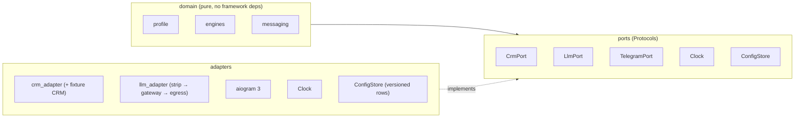
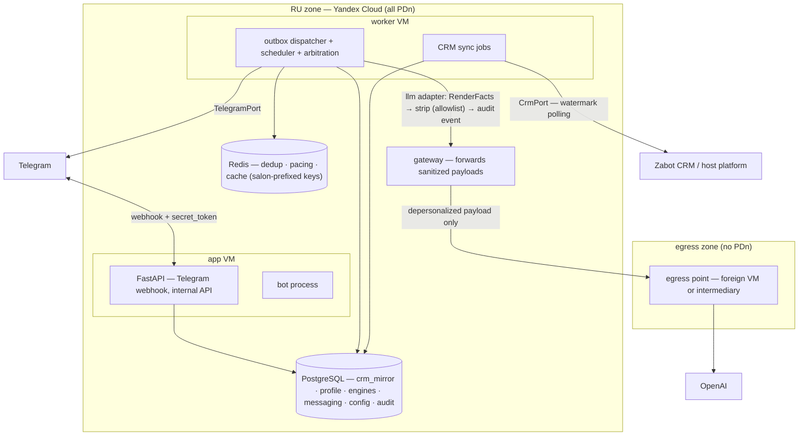
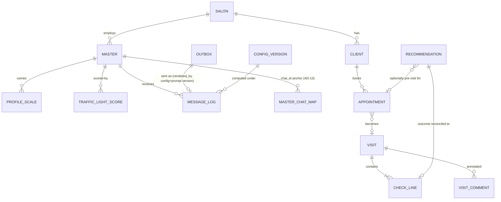

# Architecture Spine — Zabot AI Mentor, Stage 1

## Design Paradigm

**Hexagonal modular monolith.** One deployable, six modules, framework-agnostic domain. Two rules carry the whole shape:

- **Pipeline, not agent** — deterministic engines compute every number; the LLM narrates pre-computed facts, classifies inputs, and holds bounded coaching dialogue (AD-1).
- **Nothing external touches the domain** — every external system sits behind a port; every side effect with audit value goes through a durable record first (AD-2, AD-4).



Module → schema → ownership:

| Module | Owns | Postgres schema |
| --- | --- | --- |
| `crm_sync` | watermark polling, CRM mirror projections, ingestion-assigned surrogate IDs, erasure tombstones | `crm_mirror` |
| `profile` | master identity + `chat_id↔master_id` mapping, scales, traffic-light **committed** state, consent & preference state, memory recency/archival policy, insistence counters | `profile` |
| `engines` | scoring, income/forecast, recommendation, bar logic, shift-window derivation, business-KPI aggregation — pure compute | `engines` |
| `messaging` | scheduler, outbox, dispatcher, arbitration, dialogue state, `RenderFacts`/`TriggerCandidate` contracts, owner-facing render (aggregate-only) | `messaging` |
| `llm` | prompt assembly from `RenderFacts`, depersonalization strip, `LlmPort` calls, template fallback, re-personalization binding | (stateless — no schema; consumes `messaging` via its published interface) |
| `config` | insert-only versioned config + versioned prompt artifacts, editing boundary | `config` |
| cross-cutting | append-only audit | `audit` |

## Invariants & Rules

### AD-1 — Pipeline, not agent: three bounded LLM roles

- **Binds:** all modules; BRD §9.2, §10.2.1, §11.5, §15
- **Prevents:** LLM-authored money figures, scores, and rankings — hallucinated numbers violating the honesty contract; and the opposite failure, making the owner's 13.08 decision (LLM tone classification, §10.2.1) unimplementable
- **Rule:** The LLM has exactly three permitted roles: **(a) narrator** — rephrases pre-computed bound facts into psychotype-calibrated prose; **(b) structured-output classifier** — emits typed classifications (tone score 0–1 + confidence, barrier classification) that feed deterministic engines and never reach the master unvalidated; a classification below its config-set confidence threshold cannot change any state; **(c) bounded dialogue partner** — MI-style coaching, GROW options, onboarding, in-chat rehearsal under versioned prompts, where every figure remains a bound variable. Every figure (income, forecast, bar, %, score, ranking, cap count) is computed by a deterministic engine; the LLM may not emit a currency figure or metric it was not handed. The bound-variables contract is the **`RenderFacts`** Pydantic model owned by `messaging` (message class, pre-computed facts, fallback template); the `llm` module may not invent, derive, or round any field absent from it. Enforced structurally plus promptfoo golden tests in CI covering numbers, register per motivational type, and ethics cases (no cross-master comparison, no guilt/threat language).

### AD-2 — All externals behind ports

- **Binds:** all modules
- **Prevents:** provider/vendor coupling leaking into domain logic; untestable time/timezone logic
- **Rule:** The domain defines `Protocol` interfaces — `CrmPort`, `LlmPort`, `TelegramPort`, `Clock`, `ConfigStore` — implemented by adapters, wired at the edge (FastAPI DI). No external call from the domain layer. `Clock` is injectable everywhere time is read. Enforced in CI: import-linter forbids framework/adapter imports from `domain/`.

### AD-3 — CRM anti-corruption layer, watermark polling baseline

- **Binds:** `crm_sync`, `engines` (as consumers of the mirror)
- **Prevents:** Zabot/YClients field names, status enums, and semantics leaking into coaching engines; a dead system when the CRM surface answers change
- **Rule:** The Mentor owns a canonical model — `Master`, `Client`, `Appointment`, `Visit`, `CheckLine`, `VisitComment` `[ASSUMPTION: entity set pending CRM-surface Q1]` — including visit comments (allergies, contraindications, complaints), which are a hard exclusion filter (§8.2) and recommendation signal (§8.1), synced with their own freshness class. The adapter translates CRM payloads (names, enums, timezones, money formats) at the boundary. `crm_sync` assigns stable surrogate IDs at first ingestion and publishes the natural-key mapping as part of its interface; downstream modules reference only surrogate IDs. Sync = scheduled incremental polling with per-entity watermarks, upserting into the `crm_mirror` cache; deletes reconciled by periodic snapshot. Webhooks, if confirmed, only trigger targeted re-fetch by ID — never become the source of truth. A fixture CRM (recorded payloads behind `CrmPort`) doubles as the contract-test suite.

### AD-4 — Postgres is the durability backbone

- **Binds:** `messaging`, `crm_sync`, `llm`
- **Prevents:** dual-write loss (decide-to-message vs record-message), schedules dying with a Redis flush, divergent hand-rolled schedulers
- **Rule:** Every outbound side effect (Telegram send, LLM call, report) is written as an `outbox` row in the same transaction as the decision; a dispatcher sweeps due rows (`WHERE due_at <= now() AND status = 'pending'` with `FOR UPDATE SKIP LOCKED`) every 15–30 s. The outbox natural key is the originating decision row ID (1 decision row → ≤1 outbox row per channel); deferred rows carry an attempt count and max-defer lifetime ending in a terminal state — no ping-ponging forever. Redis holds only dedup keys, per-chat token buckets, and hot cache — never durable state; Redis keys are salon/master-canonical-ID-prefixed. `update_id` dedup in Redis is an optimization; the outbox natural-key idempotency is the guarantee.

### AD-5 — Two-zone data residency, with a named depersonalization owner `[ADOPTED]`

- **Binds:** deployment, `llm`, logging, secrets; BRD §13.1 (owner decision 13.08.2026)
- **Prevents:** 152-ФЗ ч.5 ст.18 violation; per-caller depersonalization drift; unprovable-clean egress; and the mirror failure of messages that can never contain the master's name
- **Rule:** All PDn (profiles, screenings, correspondence, CRM mirror, message log) stays in the RU zone (Yandex Cloud). Depersonalization happens in a **named component: the strip step inside the `llm` adapter, before the gateway**, applying a domain-side allowlist of egressible fields (versioned like config). The gateway then forwards sanitized payloads through the egress point (own foreign VM or ruble-billed intermediary — Q4). Every egress call is an audit event (payload hash + allowlist version), and an egress contract test asserts no direct identifier passes the strip point. The LLM generates against pseudonym tokens; **final message assembly re-binds real names inside the RU zone after the LLM returns** (same bound-variable mechanism as numbers, extended to identifiers). Cross-border transfer operates under art. 12 consent + Roskomnadzor notification — both launch gates. Logs everywhere are PII-scrubbed; secrets live in Yandex Lockbox.

### AD-6 — Insert-only versioned config and prompts

- **Binds:** `config`, `engines`, `messaging`; BRD §5.2.1, §6.5, §10.2.1, §11.2
- **Prevents:** unreproducible decisions ("why did the bot say that"), mid-message config drift, UPDATE-based rollback, and an income engine with no scheme taxonomy to compute against
- **Rule:** All business parameters — quiet hours, frequency caps **and** floors, trigger offsets (T-24h/T-2h, pre-visit 30–60 min), the **motivation-scheme taxonomy (the five BRD §11.2 scheme types, each with a parameter schema; fixed enumerated set at stage 1, extensible by new config versions)**, salon priorities and **stop-list**, pay period, refusal-pause N, freshness tiers and hard limits, composite-score weights, tone-confidence thresholds, hysteresis entry/exit, per-scale smoothing α, shift-window definition — live in immutable rows `(version, params JSONB, author, created_at, valid_from)`, Pydantic-validated at the editing boundary. Prompt templates and screening instruments are versioned artifacts in the same store. Every outbound message row stores the **(config_version, prompt_version)** under which every embedded figure was computed, referencing the originating score/recommendation rows (provenance chain); the dispatcher passes the config_version into engine calls so compute and send never span versions. Engines read config by version at decision time; activating a prior version is a new row; config changes are audit events. **Config-completeness degradation (§11.2):** a semantically incomplete scheme config suppresses monetary figures (metrics only) and emits an owner-clarification request — a third degradation mode alongside AD-9's freshness ladder.

### AD-7 — Salon-scoped tenancy from day one

- **Binds:** all domain schemas, all Redis keys
- **Prevents:** a schema rewrite when the isolation/role-access open question (Q2) is answered — retrofitting multi-tenancy is a rewrite
- **Rule:** Every domain row carries a salon key; all queries are salon-scoped; Redis keys carry the salon (or canonical master) prefix. Cross-salon access is impossible by construction at the query layer, whatever role model lands.

### AD-8 — UTC in the DB, local time at the decision point

- **Binds:** `messaging`, `crm_sync`, `engines`
- **Prevents:** quiet-hours and pre-visit messages firing at the wrong local time across RU's 11 static zones; shift caps counted against different windows by different modules
- **Rule:** All timestamps stored as UTC `timestamptz`. Salon/master timezone applied at render. Quiet hours (default 21:00–9:00, BRD §7.3) and pre-visit offsets (30–60 min, BRD §9.2) are evaluated at **send-decision time** against the master's local clock — never baked into a job's fire time. Shift-window derivation is owned by `engines` (pure compute, consumed via interface) with the definition pinned in config — the dispatcher's ≤5/shift cap and reporting totals use the same window.

### AD-9 — Freshness tiers, two clocks, and the two-way degradation ladder

- **Binds:** `crm_sync`, `engines`, `messaging`; BRD §5.2.1 `[ADOPTED]`
- **Prevents:** each engine inventing its own stale-data behavior; dishonest narratives during CRM outage; stale-mirror praise or wrongful suppression during recovery
- **Rule:** Every mirror row carries two timestamps: `source_event_at` (CRM-side truth) and `synced_at` (mentor-side fetch). **Freshness tiers read `synced_at`** — checks/sales ≤ 60 min, schedule/appointments ≤ 15 min, dynamics/period totals ≤ 24 h — three SLOs, alerted per class. **`suppress_backdated_events` reads `source_event_at`.** Level 1 (older than tier, younger than hard limit — checks 24 h, schedule end-of-current-day): data used with a visible timestamp label; monetary forecasts suppressed. Level 2 (older than hard limit or CRM down): communication continues without figures; money math, visit-specific praise, and forecasts suspended; master told honestly. Post-recovery: resync, recompute totals; missed event messages are **never** sent retroactively — folded into shift/period totals. **Absence ≠ staleness:** cold-start (new master/salon/client, no CRM history) uses config-defined priors per entity — conservative bars from defaults, category/seasonality priors for new clients — never blocks onboarding.

### AD-10 — Dispatcher owns arbitration, pacing, floors, and consent gates

- **Binds:** `messaging`; BRD §7.3, §9.4, §12, §15
- **Prevents:** per-module spam/arbitration logic drifting apart; the "money" class disabled first under pressure; automated force/sprint triggers bypassing the GROW consent gate; insistence past the master's "no"
- **Rule:** Engines publish a **`TriggerCandidate`** (message class, expected income, deadline, source-data timestamps) — the dispatcher's only ranking input. Competing triggers resolve by expected-income priority per master per decision window; losers deferred (AD-4 deferral caps) or merged. Hard caps (≤5 initiative messages/shift, ≤2 on days off, lower on yellow/red, BRD §7.3) and the message-class disable ladder (period totals and pre-visit recommendations disabled **last**) are enforced in the dispatcher. Telegram pacing (~1 msg/s per chat) via per-`chat_id` token buckets in Redis. **Force/sprint triggers pass through the §9.4 GROW consent gate** — never auto-initiated. The master's explicit request ("write less often") applies immediately, is owned by `profile` (consent-adjacent, audited), and overrides model inferences; ignore rate ≥70% over 2 weeks → drop to minimum and ask once about preferred format. **Insistence rule (§15):** per-topic offer counters live in `profile`; a persistent proposal is made at most twice, then fixed in the profile and dispatcher-suppressed. Message rows record `rendered_by: llm|template`. LLM cost controls live in the `llm` adapter: response length caps, per-master daily token meter, budget-trip template fallback. Owner-facing rendering (period reports §14 and red-status escalation §10.3) enforces aggregate-only/no-quotes at this boundary.

### AD-11 — Modular monolith boundaries and the inter-module contracts

- **Binds:** repo structure, all modules
- **Prevents:** a distributed monolith's ops tax now, an unextractable ball of mud later — and the `llm`/`messaging` integration deadlock where each team complies yet can't integrate
- **Rule:** One deployable. Cross-module calls only through each module's published interface; zero shared-table access across modules (`llm` is stateless and consumes `messaging` solely via its interface — the `RenderFacts` and `TriggerCandidate` models are that interface's contract); one Postgres schema per module plus append-only `audit`. Enforced in CI: import-linter module boundaries + a schema-ownership check on migrations. No microservices, no message broker as source of truth, no K8s at stage 1 (SKIP LOCKED keeps N workers possible).

### AD-12 — At-least-once everywhere, with owned key namespaces

- **Binds:** `messaging`, `crm_sync`
- **Prevents:** double sends, double counting on redelivery, and reconciliation corruption when the CRM re-keys edited rows (Q1 leaves ID stability open)
- **Rule:** Telegram handlers dedup on `update_id`; outbox sends and sync upserts are idempotent by natural key. Natural-key namespaces are defined per entity by `crm_sync` and published with its interface; downstream reconciliation references ingestion-assigned surrogate IDs (AD-3) — a re-keyed source row maps to the same surrogate. Recommendation-outcome reconciliation (check contents only, never asking the master) is idempotent per visit.

### AD-13 — One canonical master identity, one owner of the anchor mapping

- **Binds:** `profile`, `messaging`, `crm_sync`, `engines`
- **Prevents:** caps, arbitration, and consent counted against one key while sends execute against another (double sends, caps bypassed across two chat_ids — a consent-integrity failure under 152-ФЗ)
- **Rule:** There is exactly one canonical internal `master_id` (owned by `profile`). Every cross-module reference — outbox rows, engine scores, dedup keys, Redis keys, audit events — carries the canonical ID. The `chat_id ↔ master_id` mapping table is owned by `profile`, which also defines merge/split behavior when a master changes Telegram account, links a second account, or is re-created in the CRM.

### AD-14 — Single-owner state mutation

- **Binds:** `profile`, `engines`, `messaging`
- **Prevents:** hysteresis applied twice or zero times; the dispatcher pacing against a stale or uncommitted traffic-light color (full-rate messaging to a red master)
- **Rule:** Every stateful entity has exactly one owning module, mutated through one named path. Traffic light: `engines` publish score + recommended transition (pure compute); `profile` applies hysteresis and owns the **committed** color; the dispatcher reads the committed color via `profile`'s interface at decision time — never a cached engine inference. The same rule governs scales (profile owns smoothing updates; engines only read) and consent/preference state (profile).

### AD-15 — Erasure propagates everywhere the data is

- **Binds:** `profile`, `crm_sync`, `audit`
- **Prevents:** deleted PDn resurrecting from the CRM-mirror snapshot reconciliation on the next sync
- **Rule:** An erasure/deletion request (audit event listing purged schemas/rows) produces tombstones in `crm_mirror` keyed by canonical ID that survive snapshot reconciliation and suppress re-ingestion; `profile` PDn is purged with the same event. Memory recency/archival policy (§13) is config-driven and owned by `profile`: fresh signals outweigh old, archived observations leave the prompt set, negative episodes are retained only as support material — never as prompt pressure.

## Consistency Conventions

| Concern | Convention |
| --- | --- |
| Naming | Python `snake_case` modules/tables; ports named `XxxPort`; canonical entities `Master`, `Client`, `Appointment`, `Visit`, `CheckLine`, `VisitComment` |
| Schema layer | Pydantic models are the single definition from transport (webhook/CRM/LLM structured output) to storage (JSONB typed via the same models) |
| Identity | Canonical internal `master_id` on every cross-module reference (AD-13); `chat_id` is the Telegram transport anchor; machine-to-machine API keys only (no OAuth); salon key on every domain row |
| Time | UTC `timestamptz` everywhere in storage; `source_event_at` vs `synced_at` per mirror row (AD-9); local rendering only at send decision (AD-8) |
| Mutation | No side effect without a durable record first (outbox row / audit entry / config-version reference). `audit` is append-only: config changes, consent events, profile scale/type changes **with justification** (§6.5), LLM egress events, erasure requests and what they purged, export/delete requests, sync runs |
| Errors & fallbacks | LLM failure → deterministic template fallback (`rendered_by` recorded); quiet-hours miss → defer to next window; CRM stale → AD-9 ladder; incomplete scheme config → AD-6 completeness mode |
| Logging & observability | Structured JSON, PII-scrubbed; alerting on user-visible SLOs (per-entity freshness, oldest pending outbox row, LLM-port error rate, quiet-hours defer rate), not CPU |
| Environments & DR | prod: webhook mode, RU cloud; dev: aiogram polling profile + fixture CRM; staging = dedicated test bot. DR: managed backups + PITR — RPO ≤ 15 min, RTO ≤ 4 h, quarterly restore drill; PDn retention periods open (Q3) |
| Channel independence | Message content decisions (format, frequency, tone) are channel-agnostic (§3.1); Telegram specifics confined to the adapter; chat UI growth path = Mini App / own app via `TelegramPort`-style ports |

## Stack

*Seed — technologies verified current 2026-08-16/17 (research) and re-checked 2026-08-18 (gate); loose versions pinned in `pyproject`/compose at M0.*

| Name | Version |
| --- | --- |
| Python | 3.12+ |
| FastAPI (webhooks / internal API) | pinned at M0 (0.141.x current) |
| aiogram 3 (Telegram bot) | 3.x (3.30.x current) |
| PostgreSQL (managed, Yandex Cloud) | 17 (Yandex offers 14–18; single-major-upgrade policy — pin at M0) |
| Redis | pinned at M0 (8.x current) |
| Deploy | docker compose, 2 VMs (app node + worker node), Yandex Container Registry |
| CI/CD | GitHub private repo + self-hosted RU runner (GitLab CE fallback) |
| Testing | pytest + pytest-asyncio, promptfoo (LLM golden set) |
| LLM hop | ProxyAPI **or** own egress VM (open — Q4), OpenAI behind `LlmPort` |
| Observability | Sentry, Grafana / Yandex Cloud Monitoring |

## Structural Seed



Core entities (names + relationships; invariant attributes are ADs above):



Minimal source tree:

```text
src/
  domain/          # pure: entities, engines, ports (Protocols) — no framework imports
    profile/  engines/  messaging/
  adapters/        # crm_adapter (+ fixture), llm (strip → gateway), telegram (aiogram), clock, config_store
  app/             # FastAPI wiring, DI, webhook endpoint
  worker/          # scheduler entry, outbox dispatcher + arbitration, sync jobs
tests/
  unit/            # engines, hysteresis, income math, quiet hours via injected Clock
  contract/        # CRM fixture replay, egress strip assertions
  golden/          # promptfoo: facts present, no invented numbers, register + ethics cases
```

## Capability → Architecture Map

| BRD area | Lives in | Governed by |
| --- | --- | --- |
| §6 profiling (types + live scales, smoothing) | `profile` + `engines` | AD-1, AD-6, AD-14 |
| §7 communication matrix (contract, caps, quiet hours) | `messaging` + `profile` | AD-8, AD-10 |
| §8 recommendation engine (candidates/filters/rank/1–3 cap, check-reconciliation loop) | `engines` | AD-1, AD-3, AD-9, AD-12 |
| §9 coaching cycles (shift/week/period, GROW, forcing) | `messaging` + `engines` | AD-4, AD-8, AD-10 (consent gate), AD-14 |
| §10 emotional monitoring, traffic light | `engines` (scoring) + `profile` (committed state) | AD-1 (classifier role), AD-6, AD-14 |
| §11 goals, adaptive bar, motivation schemes | `engines` + `config` | AD-1, AD-6 |
| §12 proactivity triggers | `messaging` dispatcher | AD-10 |
| §13 memory, PDn handling, erasure | `profile`, `crm_sync`, `audit`, `llm` strip | AD-5, AD-7, AD-13, AD-15 |
| §14 owner reporting (aggregate only, no quotes) | `engines` (KPI aggregation) + `messaging` (render) | AD-5, AD-10 |
| §15 ethics & honesty constraints | `profile` (counters) + dispatcher + golden set | AD-1, AD-10 |
| §16 business KPIs | `engines` (aggregation jobs) | AD-1, AD-6; read-receipt trap → Q5 |
| §5.2.1 freshness & degradation | `crm_sync` + `engines` | AD-9 |
| Onboarding (`/start`, consent, primary profiling, 2-week calibration) | `messaging` + `profile` | AD-5, AD-10, AD-12 |

## Deferred

- **Task-queue library (Celery vs Taskiq)** — Postgres-first scheduling is the durability layer; a queue would only fan out already-durable intents. Decide if sweep latency ever matters.
- **Egress mechanism details** (own VM vs ProxyAPI) — Q4; the `LlmPort` hides the choice.
- **Two-way Zabot goals sync (§11.1)** — service owns the goals module and is master at stage 1; sketch a `GoalsSyncPort` (outbound goal/bar replication, read-mode fallback) only when Zabot ships its own goals functionality.
- **Owner/admin surface beyond a reviewed CLI script** against config tables.
- **Telegram Mini App / own mobile app** — the named growth path when chat buttons run out; RU-hosted; channel-agnostic content (conventions) keeps it cheap.
- **pgvector** client-history similarity; **pseudonymization tokens** for egress logs — later hardening.
- **Multi-provider LLM routing** per message class on price/quality.
- **Horizontal dispatcher / Managed K8s** — SKIP LOCKED already allows N workers; adopt only if load justifies.
- **Memory archival schedule details** — policy shape is AD-15; concrete periods config-driven at pilot calibration.
- **Internal ID formats, API versioning, repo-internal layout details** — code-owned once it exists.

## Open Questions

- **Q1 — CRM surface** (owner-dependent, letter sent): own API vs host-platform token; webhooks or polling only; historical exports for seeding; **stable entity IDs** (AD-3/AD-12 surrogate IDs hedge this). `CrmPort` + fixture CRM keep it off the critical path through M0.
- **Q2 — Salon isolation & role-access model** (BRD §3). Gates authorization design; AD-7 hedges the schema.
- **Q3 — Consent triad + retention**: unified vs separate consents, revocation mechanism (and its operational effect on the dispatcher/profile), PDn operator/registry, **PDn retention periods**. Gates the Roskomnadzor notification.
- **Q4 — Egress mechanism**: own foreign VM vs intermediary — markup is model-dependent (up to ~×4.3) and intermediaries operate as unauthorized resellers outside OpenAI ToS (verified 2026-08-18); decide together with model selection — the ToS/volatility risk is part of the trade.
- **Q5 — Engagement measurability**: Telegram provides no read receipts; "share read" KPIs (§16) and the behavioral profiling stream (§6.5 "читает ли сообщения") must be defined as answered/ignored-based — flag the delta to the BRD owner.
