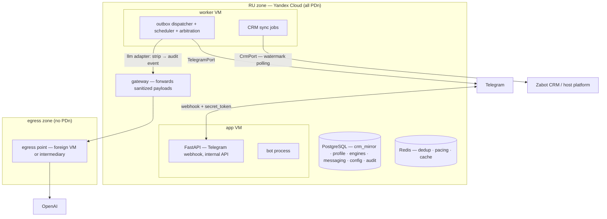

# Zabot AI Mentor — Stage 1 Solution Design

*For engineers joining the project who weren't in the research. This document explains **why**; the normative contract is [`ARCHITECTURE-SPINE.md`](ARCHITECTURE-SPINE.md) — when the two disagree, the spine wins. Companion materials: the [stage-1 reference-architecture research](../../research/technical-stage1-reference-architecture-zabot-ai-mentor-research-2026-08-16.md) (sources and trade-off analysis) and the BRD `docs/zabot_ai.md` v2.1 (product behavior).*

---

## 1. What we're building, in one paragraph

A Telegram-first AI coaching service for beauty-salon masters. It reads salon data from Zabot CRM, computes per-master coaching facts deterministically (income against the salon's motivation scheme, next-best-offer recommendations per client, an emotional-state "traffic light"), narrates those facts through an LLM calibrated to each master's motivational profile, and reports aggregates to the salon owner — all under Russian personal-data law (152-ФЗ), which physically zones the system.

## 2. The three constraints that shaped everything

Every load-bearing decision traces back to one of these. If you're wondering "why not X?", the answer is probably here.

1. **The CRM surface is undocumented.** Zabot CRM has no public API docs (verified 2026-08-16). We don't know yet whether integration happens via Zabot's own API, the host platform (YClients), or CSV exports. → Everything CRM-facing sits behind `CrmPort` with our own canonical model; a fixture CRM keeps weeks 1–4 unblocked; four owner questions (Q1) are pending.
2. **OpenAI geo-blocks Russian IPs.** → All PDn stays in a RU zone (Yandex Cloud); LLM calls leave only as depersonalized payloads through a foreign egress point (Q4: own VM vs ruble-billed intermediary like ProxyAPI). This is a legal design (ч.5 ст.18 + art. 12 consent + Roskomnadzor notification), not an ops preference.
3. **Honesty in numbers is the product's trust core** (BRD §15). → The system is a **pipeline, not an agent**: deterministic engines compute every figure; the LLM narrates, classifies, and coaches — it never authors a number.

Plus one scale fact: hundreds of masters ≈ a few messages/second. Scalability is explicitly *not* a stage-1 driver; boring infrastructure wins everywhere it can.

## 3. The shape

**Hexagonal modular monolith.** One Python 3.12+ deployable (FastAPI + aiogram 3), six modules, PostgreSQL 17 as the durability backbone, Redis for dedup/pacing only, docker compose on two Yandex Cloud VMs. No Kubernetes, no message broker as source of truth, no microservices, no agent framework.

### Modules and what each owns

| Module | Owns | Why it's separate |
| --- | --- | --- |
| `crm_sync` | watermark polling, mirror projections, surrogate IDs, erasure tombstones | The CRM is *external state we project*, not our domain. Keeping it a separate bounded context (and schema) means CRM chaos can't leak into engines (AD-3). |
| `profile` | master identity + `chat_id` mapping, scales, **committed** traffic-light state, consent/preferences, insistence counters, memory policy | Identity and consent must have exactly one owner (AD-13, AD-14) — split ownership is how caps get bypassed and consent records detach from sends. |
| `engines` | scoring, income/forecast, recommendation, bar logic, shift windows, KPI aggregation | Pure functions over dataclasses. This is what makes hysteresis, smoothing-α, and the salon-specific income math cheaply testable (AD-1). |
| `messaging` | scheduler, outbox, dispatcher, arbitration, dialogue state, `RenderFacts`/`TriggerCandidate`, owner-facing render | All send decisions in one place: caps, floors, arbitration, consent gates (AD-4, AD-10). |
| `llm` | prompt assembly, depersonalization strip, `LlmPort`, template fallback, re-personalization | The only module that talks to the LLM; stateless; the compliance choke point (AD-5). |
| `config` | insert-only versioned config **and prompts** | Reproducibility: every message re-derivable from (facts, config_version, prompt_version) — the owner's "why did the bot say that" is a query (AD-6). |

## 4. Key flows

### 4.1 A pre-visit recommendation (the money flow)

1. `crm_sync` polls appointments (freshness SLO ≤ 15 min, judged on `synced_at`).
2. At T-30–60 min local (evaluated **at send-decision time**, never baked into the job — AD-8), the recommendation engine builds candidates: owner priorities ∪ client-history implications; excludes by refusal history (≥2 consecutive → N-month pause), contraindications from visit comments, stop-list; ranks by expected value; caps at 1–3, fewer is better.
3. The engine's output becomes a `TriggerCandidate`; the dispatcher arbitrates it against competing triggers by expected-income priority, enforces caps/floors, quiet hours, the GROW consent gate, and the insistence rule.
4. On send: `messaging` builds `RenderFacts` (pre-computed facts + fallback template), `llm` strips identifiers (allowlist), audits the egress, calls OpenAI via the gateway/egress point, and **re-binds real names inside the RU zone** on return. LLM failure → the pre-computed template still goes out; wording degrades, correctness never does.
5. After the visit, the engine reconciles the outcome from the check contents only — **the master is never asked** (§8.4). Outcomes update client profile, master conversion stats, engine quality stats.

### 4.2 Degradation when the CRM is stale or down (AD-9)

Two clocks on every mirror row: `source_event_at` (when it happened in the CRM) and `synced_at` (when we fetched it). Tiers and SLOs read `synced_at`; "don't backdate event messages" reads `source_event_at`. Level 1 (stale but usable): data carries a visible «по данным на 14:30» label, monetary forecasts suppressed. Level 2 (hard stale / CRM down): coaching and profile-based support continue **without figures**; money math, visit praise, and forecasts suspend; the master is told honestly. Post-recovery: totals recomputed; missed event messages fold into shift/period totals — never sent retroactively. Absence (new master/salon/client) is a different problem from staleness: config-defined priors, not a ladder.

### 4.3 The traffic light (state ownership, AD-14)

Three signal streams — mood screenings (normalized 0–100), **LLM tone classification** (0–1 score *with confidence*; below the threshold it cannot change state), CRM proxies — feed a weighted composite score (weights in config). Engines compute the score and a *recommended* transition; **`profile` applies hysteresis and owns the committed color**; the dispatcher reads the committed color at decision time. One owner per stateful entity is the rule — it's what prevents full-rate messaging to a red master.

## 5. The invariants, and the divergence each one kills

The spine's 15 ADs in one table — the "prevents" column is the real content:

| AD | Rule (essence) | Divergence it kills |
| --- | --- | --- |
| 1 | Three bounded LLM roles; no LLM-authored figures; `RenderFacts` contract | Hallucinated money; also the opposite: blocking the owner's tone-classifier decision |
| 2 | All externals behind ports; injectable `Clock` | Vendor lock-in; untestable timezone logic |
| 3 | CRM ACL + canonical model + watermark polling; surrogate IDs | CRM concepts leaking into engines; unstable source IDs corrupting reconciliation |
| 4 | Outbox + DB-backed scheduler; Redis never durable | Dual-write loss; schedules dying with a cache flush |
| 5 | Two zones; named strip component; egress audit; re-personalization in RU | PDn crossing the border; messages that can never contain names |
| 6 | Insert-only versioned config + prompts; provenance chain | Unreproducible "why did the bot say that"; mid-message config drift |
| 7 | Salon key on every row (and Redis key) | Multi-tenancy retrofit = rewrite |
| 8 | UTC in DB; local time at decision; one shift-window definition | 23:00 messages; caps counted against different windows |
| 9 | Freshness tiers; two clocks; degradation ladder; cold-start priors | Each engine inventing stale-data behavior; backdated praise |
| 10 | Dispatcher owns arbitration/caps/floors/consent gates/insistence | Per-module spam logic; force-triggers without consent |
| 11 | Interface-only cross-module calls; no shared tables | Integration deadlock (llm vs messaging); ball of mud |
| 12 | At-least-once; owned key namespaces | Double sends; re-keyed CRM rows double-counting |
| 13 | One canonical `master_id`; profile owns the anchor map | Caps/consent on one key, sends on another |
| 14 | One owner per stateful entity (traffic light spelled out) | Hysteresis twice or never; stale color driving pacing |
| 15 | Erasure tombstones survive snapshot reconciliation | Deleted PDn resurrecting on next sync |

## 6. Testing strategy (three layers)

1. **Pure-function unit tests** (pytest) — engines, hysteresis, income math per scheme type, quiet-hours/DST via the injected `Clock`. The bulk of the suite; engines are pure by design.
2. **LLM golden tests** (promptfoo, in CI) — *given pre-computed facts + psychotype: output contains the facts, never invents numbers, holds register per motivational type, no ethics violations* (no cross-master comparison, no guilt/threat language). Plus the egress strip contract test (no identifier past the strip point) and CRM fixture replay (recorded payloads → canonical-model assertions).
3. **E2E smoke** against a dedicated test bot with the fixture CRM — full loop including rate-limit pacing.

## 7. Build order (de-risked against the open questions)

- **M0 (wks 1–4), no CRM dependency:** walking skeleton — Telegram webhook, `/start` onboarding + consent, config versioning, outbox + scheduler + quiet hours, template messages, audit tables. Fixture CRM behind `CrmPort`.
- **M1 (wks 5–8), gated on Q1 answers:** real CRM adapter (or CSV fallback), watermark sync, mirror, freshness SLOs, first degradation mode.
- **M2 (wks 9–14):** traffic light, income/forecast per scheme taxonomy, recommendation engine + reconciliation loop, trigger arbitration, floors, LLM port via egress, golden set in CI.
- **M3 (wks 15–18):** owner reporting, degradation drills, Roskomnadzor file, DR restore test, pilot with 1–2 salons.

## 8. What's deliberately *not* decided (and who unblocks it)

| Item | Status | Unblocker |
| --- | --- | --- |
| CRM surface facts (API? webhooks? history export? stable IDs?) | Q1 — letter to owner sent | Owner answers; `CrmPort` absorbs the result |
| Salon isolation & role-access model | Q2 | Owner; AD-7 hedges the schema meanwhile |
| Consent triad + retention periods | Q3 | Owner/legal; gates Roskomnadzor notification |
| Egress mechanism (own VM vs ProxyAPI) | Q4 | Priced model selection; note intermediaries are unauthorized resellers — ToS/volatility risk is part of the trade |
| "Read" KPIs | Q5 | Telegram has no read receipts — engagement must be answered/ignored-based; flag to BRD owner |
| Task queue, pgvector, Mini App, multi-provider routing, K8s | Deferred | Load/need; see spine's Deferred list |

## 9. Practical norms

- Trunk-based, small PRs, CI on a self-hosted RU runner: ruff, mypy, unit, contract, golden, image build. Import-linter enforces domain purity and module boundaries; a schema-ownership check guards migrations.
- Config changes are code-like: reviewed, Pydantic-validated at the editing boundary, instantly rollable (activation of a prior version is a new row).
- Alerting is on user-visible SLOs — per-entity CRM freshness (three tiers), oldest pending outbox row, LLM-port error rate, quiet-hours defer rate — not CPU. Each maps to a degradation mode with a runbook.
- DR: managed PostgreSQL backups + PITR, RPO ≤ 15 min / RTO ≤ 4 h, quarterly restore drill.

---

*Questions the spine doesn't answer are open questions, not invitations to improvise — check the spine's Open Questions section and the memlog (`.memlog.md`) before deciding.*
