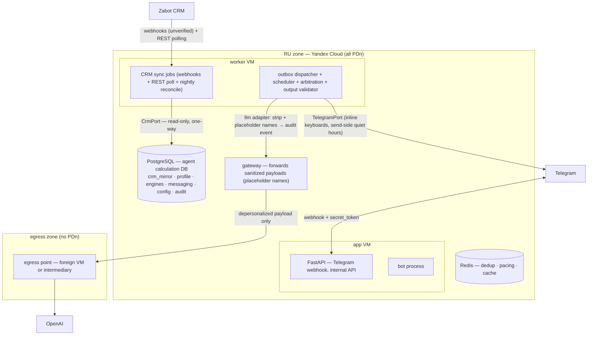

# Zabot AI Mentor — Stage 1 Solution Design

*For engineers joining the project who weren't in the research. This document explains **why**; the normative contract is [`ARCHITECTURE-SPINE.md`](ARCHITECTURE-SPINE.md) — when the two disagree, the spine wins. Companion materials: the [stage-1 reference-architecture research](../../research/technical-stage1-reference-architecture-zabot-ai-mentor-research-2026-08-16.md) (sources and trade-off analysis), the BRD `docs/zabot_ai.md` v2.1 (product behavior, v2.2 pending — see OQ-12), the [Team Q&A with owner answers](../../../docs/Вопросы_команды_и_ответы_по_БТ_v2_1.md) (23.08.2026 — the change signal for the 2026-08-23 architecture update), and the [PRD](../../prds/prd-zabota_mentor-2026-08-18/prd.md) (updated 2026-08-23).*

---

## 1. What we're building, in one paragraph

A Telegram-first AI coaching service for beauty-salon masters. It reads salon data from Zabot CRM (read-only, one-way), replicates the needed entities into its **own calculation DB**, computes per-master coaching facts deterministically (progress against the salon's 2 Zabot plan types — average check and total revenue — next-best-offer recommendations per client, an adaptive bar, an emotional-state "traffic light"), narrates those facts through an LLM calibrated to each master's motivational profile, and reports aggregates to the salon owner — all under Russian personal-data law (152-ФЗ), which physically zones the system and forces 4 separate consents.

## 2. The constraints that shaped everything

Every load-bearing decision traces back to one of these. If you're wondering "why not X?", the answer is probably here.

1. **The CRM surface is undocumented and Zabot won't be modified.** Zabot CRM has no public API docs (verified 2026-08-16) and the owner confirmed доработки Zabot не планируются. → Everything CRM-facing sits behind `CrmPort` with our own canonical model; integration is **webhooks (unverified) + REST polling + nightly full reconcile, strictly one-way read-only** (AD-3); a fixture CRM keeps weeks 1–4 unblocked; the remaining open question (OQ-1) is field-surface verification, not the integration shape. Because Zabot won't change, the agent owns a **separate calculation DB** with all derived values — Zabot is master of operational data + the 2 plan types, the agent is master of everything it computes (AD-3).
2. **OpenAI geo-blocks Russian IPs.** → All PDn stays in a RU zone (Yandex Cloud); LLM calls leave only as depersonalized payloads through a foreign egress point (OQ-6: own VM vs ruble-billed intermediary). This is a legal design (ч.5 ст.18 + art. 12 consent + Roskomnadzor notification), not an ops preference. **Direct identifiers don't enter prompts even in the depersonalized circuit** — the strip step substitutes internal IDs + placeholder names, and reverse substitution re-binds real names inside the RU zone after the LLM returns (AD-5).
3. **Honesty in numbers is the product's trust core** (BRD §15). → The system is a **pipeline, not an agent**: deterministic engines compute every figure; the LLM narrates, classifies, and coaches — it never authors a number. **An output validator hard-enforces this on the egress path: any mismatched money-type number blocks the send and a template fallback goes out instead** (AD-16). Wording degrades; correctness never does.

Plus one scale fact: hundreds of masters ≈ a few messages/second. Scalability is explicitly *not* a stage-1 driver; boring infrastructure wins everywhere it can.

## 3. The shape

**Hexagonal modular monolith.** One Python 3.12+ deployable (FastAPI + aiogram 3), six modules, PostgreSQL 17 as the durability backbone (and the agent calculation DB), Redis for dedup/pacing only, docker compose on two Yandex Cloud VMs. No Kubernetes, no message broker as source of truth, no microservices, no agent framework.

### Modules and what each owns

| Module | Owns | Why it's separate |
| --- | --- | --- |
| `crm_sync` | webhook ingest (unverified) + REST polling + nightly reconcile, mirror projections, surrogate IDs, erasure tombstones | The CRM is *external state we project read-only*, not our domain. Keeping it a separate bounded context (and schema) means CRM chaos can't leak into engines (AD-3). |
| `profile` | master identity + `chat_id` mapping, **psych profile (master-level, not salon-scoped)**, scales, **committed** traffic-light state, **4-consent state (AD-17)**, preferences, insistence counters, pause/opt-out state, memory policy | Identity, consent, and psych state must have exactly one owner (AD-13, AD-14, AD-17) — split ownership is how caps get bypassed, consent records detach from sends, and the psych layer leaks to owners. |
| `engines` | scoring, income/forecast, recommendation, **adaptive bar (agent-calc-DB master)**, shift windows, KPI aggregation | Pure functions over the agent calculation DB. This is what makes hysteresis, smoothing-α, the bar corridor, and the salon-specific income math cheaply testable (AD-1, AD-3). |
| `messaging` | scheduler, outbox, dispatcher, arbitration, dialogue state, `RenderFacts`/`TriggerCandidate`, **output validator (AD-16)**, owner-facing render (aggregate-only, psych-layer-inaccessible) | All send decisions in one place: caps, floors, arbitration, consent gates, send-side quiet hours (AD-4, AD-10, AD-16). |
| `llm` | prompt assembly, depersonalization strip + **placeholder-name substitution**, `LlmPort`, template fallback, reverse-substitution re-personalization | The only module that talks to the LLM; stateless; the compliance choke point (AD-5). `LlmPort` is single-port — provider swap without domain rework. |
| `config` | insert-only versioned config **and prompts** | Reproducibility: every message re-derivable from (facts, config_version, prompt_version) — the owner's "why did the bot say that" is a query (AD-6). |

## 4. Key flows

### 4.1 A pre-visit recommendation (the money flow)

1. `crm_sync` receives a webhook (or polls) for an upcoming appointment (freshness SLO ≤ 15 min, judged on `synced_at`).
2. At T-30–60 min **salon TZ** (evaluated **at send-decision time**, never baked into the job — AD-8), the recommendation engine builds candidates from the agent calculation DB: owner priorities ∪ client-history implications; excludes by refusal history (≥2 consecutive → N-month pause), contraindications from visit comments, stop-list; ranks by expected value; caps at 1–3, fewer is better.
3. The engine's output becomes a `TriggerCandidate`; the dispatcher arbitrates it against competing triggers by expected-income priority, enforces caps/floors, **send-side quiet hours (master TZ)**, the GROW consent gate, and the insistence rule.
4. On send: `messaging` builds `RenderFacts` (pre-computed facts + fallback template), `llm` strips identifiers and substitutes **placeholder names** (allowlist + placeholder map, audited), calls OpenAI via the gateway/egress point, and **re-binds real names inside the RU zone** on return. **The output validator (AD-16) then checks every money-type number in the rendered message against `RenderFacts`; on mismatch the message is NOT sent and a template fallback is queued.** LLM failure → the pre-computed template still goes out; wording degrades, correctness never does.
5. After the visit, the engine reconciles the outcome from the check contents only — **the master is never asked** (§8.4). Outcomes update client profile, master conversion stats, engine quality stats. **Late-praise exception (AD-9):** if the praise for a successful recommendation was missed, it may be sent within 60 min but no later than the end of the same shift — better late than never.

### 4.2 Degradation when the CRM is stale or down (AD-9)

Two clocks on every mirror row: `source_event_at` (when it happened in the CRM) and `synced_at` (when we fetched it). Tiers and SLOs read `synced_at`; "don't backdate event messages" reads `source_event_at`. Level 1 (stale but usable): data carries a visible «по данным на 14:30» label, monetary forecasts suppressed. Level 2 (hard stale / CRM down): coaching and profile-based support continue **without figures**; money math, visit praise, and forecasts suspend; the master is told honestly. Post-recovery: totals recomputed; missed event messages fold into shift/period totals — never sent retroactively, **except late praise for a successful recommendation (within 60 min, end of shift)**. The nightly full reconcile (AD-3) heals anything the webhooks/polling missed. Absence (new master/salon/client) is a different problem from staleness: config-defined priors, not a ladder.

### 4.3 The traffic light (state ownership, AD-14)

Three signal streams — mood screenings (normalized 0–100, inline-keyboard 1–5 buttons), **LLM tone classification** (0–1 score *with confidence*; below the threshold it cannot change state), CRM proxies — feed a weighted composite score (weights in config). Engines compute the score and a *recommended* transition; **`profile` applies hysteresis and owns the committed color**; the dispatcher reads the committed color at decision time. **Consent interacts with the score (AD-17):** if consent #2 (emotional-state data) is withdrawn, the screenings/tone stream drops out and the composite re-weights to CRM-signal-only — the re-weighting rule is config-owned, the consent state is profile-owned. One owner per stateful entity is the rule — it's what prevents full-rate messaging to a red master.

### 4.4 Consent and the aggregated-profile mode (AD-17)

Four consents collected at onboarding before any profiling question: (1) PDn+profiling [required — without it, no service]; (2) emotional-state data; (3) correspondence retention; (4) cross-border transfer. (2) and (3) are independently revocable via a bot command. Withdrawing (2) disables screenings/tone (traffic light → CRM signals only). Withdrawing (3) switches memory to **aggregated-profile-only mode**: raw correspondence and quotes are deleted; the aggregated profile (type, scales + values, traffic-light status + transition history) is retained. Withdrawing (4) blocks LLM egress → template-only narration. Withdrawing (1) = full opt-out. Every profiling/egress decision links to an active consent record at the decision boundary, not just in a log.

## 5. The invariants, and the divergence each one kills

The spine's 17 ADs in one table — the "prevents" column is the real content:

| AD | Rule (essence) | Divergence it kills |
| --- | --- | --- |
| 1 | Three bounded LLM roles; no LLM-authored figures; `RenderFacts` contract; output validator hard-enforces | Hallucinated money; also the opposite: blocking the owner's tone-classifier decision |
| 2 | All externals behind ports; injectable `Clock`; single `LlmPort` for provider swap | Vendor lock-in; untestable timezone logic |
| 3 | CRM ACL + canonical model + **webhook+poll+nightly-reconcile, read-only one-way** + **agent calculation DB (master of derived values)** + 2 Zabot plan types only | CRM concepts leaking into engines; dual-master data conflicts; the §11.1 two-way-sync fiction |
| 4 | Outbox + DB-backed scheduler; Redis never durable | Dual-write loss; schedules dying with a cache flush |
| 5 | Two zones; named strip component; **placeholder-name egress + reverse substitution**; egress audit; re-personalization in RU | PDn crossing the border; raw identifiers in prompts; messages that can never contain names |
| 6 | Insert-only versioned config + prompts; provenance chain; **2 plan types, bar corridor, calibration guidance, ruble gate** | Unreproducible "why did the bot say that"; mid-message config drift; salary math without remuneration rules |
| 7 | Salon key on every row; **psych layer inaccessible to owner**; **master-in-two-salons = 1 psych profile + 2 work contexts**; admin-role extensibility | Multi-tenancy retrofit = rewrite; owner seeing the psych layer (master-trust failure); admin role = permissions rewrite |
| 8 | UTC in DB; **dual TZ stored (salon + master)**; quiet hours + personal sends in master TZ; pre-visit in salon TZ | 23:00 messages; a master on a different TZ than the salon getting pinged at the wrong time |
| 9 | Freshness tiers; two clocks; degradation ladder; cold-start priors; **late-praise exception** | Each engine inventing stale-data behavior; backdated praise; losing the most valuable reinforcement |
| 10 | Dispatcher owns arbitration/caps/floors/consent gates/insistence/**send-side quiet hours**/**inline keyboards**/**floor/pause/opt-out** | Per-module spam logic; force-triggers without consent; best-effort quiet hours; a master who can't actually stop communication |
| 11 | Interface-only cross-module calls; no shared tables; output validator owned by messaging | Integration deadlock (llm vs messaging); ball of mud |
| 12 | At-least-once; owned key namespaces; nightly reconcile idempotent | Double sends; re-keyed CRM rows double-counting |
| 13 | One canonical `master_id`; profile owns the anchor map; **psych profile off `master_id`, work context off (`master_id`,`salon_id`)** | Caps/consent on one key, sends on another; two-salon master modeled as two people or one leaking context |
| 14 | One owner per stateful entity (traffic light, scales, consent, pause); **consent revocation re-weights the composite score** | Hysteresis twice or never; stale color driving pacing; egress proceeding on stale consent |
| 15 | Erasure tombstones survive snapshot reconciliation; **consent #3 revocation → scoped correspondence erasure** | Deleted PDn resurrecting on next sync; raw correspondence surviving a revocation |
| 16 | **Output validator on egress: every money number = `RenderFacts` number, else hard fail + template fallback** | Any LLM-authored/rounded/extra number reaching the master (CM-4) |
| 17 | **4 separate consents + independent revocation of (2)/(3) + aggregated-profile mode + consent-gated egress** | Bundled all-or-nothing consent; egress without cross-border consent; profiling without a live consent record |

## 6. Testing strategy (three layers)

1. **Pure-function unit tests** (pytest) — engines, hysteresis, income math per the 2 plan types, **adaptive bar corridor (±15/+10/−15)**, quiet-hours/DST via the injected `Clock`, **output validator** (inject a wrong number, assert hard-fail + template fallback), **consent re-weighting** (withdraw #2 → CRM-signal-only score). The bulk of the suite; engines are pure by design.
2. **LLM golden tests** (promptfoo, in CI) — *given pre-computed facts + psychotype: output contains the facts, never invents numbers, holds register per motivational type, no ethics violations* (no cross-master comparison, no guilt/threat language). Plus the egress strip + **placeholder-name** contract test (no identifier, no raw name past the strip point) and CRM fixture replay (recorded payloads → canonical-model assertions). **The validator is covered by injecting a wrong number into golden cases and asserting the send is blocked.**
3. **E2E smoke** against a dedicated test bot with the fixture CRM — full loop including rate-limit pacing, inline-keyboard screenings, and send-side quiet hours.

## 7. Build order (de-risked against the open questions)

- **M0 (wks 1–4), no CRM dependency:** walking skeleton — Telegram webhook, `/start` onboarding + **4 consents (AD-17)**, config versioning, outbox + scheduler + **send-side quiet hours (dual TZ)**, template messages, audit tables, **output validator on the egress path**. Fixture CRM behind `CrmPort`.
- **M1 (wks 5–8), gated on OQ-1 (Zabot API field verification):** real CRM adapter — **webhook ingest + REST polling + nightly reconcile, read-only**; mirror + agent calculation DB; freshness SLOs; first degradation mode; late-praise exception.
- **M2 (wks 9–14):** traffic light (3 streams + hysteresis + calibration guidance), income/forecast per the **2 Zabot plan types**, **adaptive bar engine (corridor; probability method → OQ-10)**, recommendation engine + reconciliation loop, trigger arbitration, floors, LLM port via egress (**placeholder names + reverse substitution**), **consent re-weighting**, golden set in CI.
- **M3 (wks 15–18):** owner reporting (aggregate-only, psych-layer-inaccessible), degradation drills, Roskomnadzor file, DR restore test, pilot with 1–2 salons.

## 8. What's deliberately *not* decided (and who unblocks it)

| Item | Status | Unblocker |
| --- | --- | --- |
| Zabot API field surface (plans, checks, bookings, webhooks) | OQ-1 — sync shape decided, field verification pending (team item 1) | Zabot owner; `CrmPort` absorbs the result |
| PDn retention periods | OQ-3 — consent model resolved, retention periods open | Owner/legal; gates Roskomnadzor notification |
| Egress mechanism (own VM vs ProxyAPI) | OQ-6 | Priced model selection; note intermediaries are unauthorized resellers — ToS/volatility risk is part of the trade |
| Adaptive bar attainment-probability method | OQ-10 `[уточнить]` — corridor fixed, ~60–70% probability calculation method open (candidate: linear projection + historical dispersion) | Owner + tech |
| PDn operator legal entity name | OQ-11 `[уточнить]` | Owner + counsel; launch gate |
| BRD §11.3/§11.5 corrections (scheme-constructor removal) | OQ-12 `[уточнить]` | Owner + PM; gates BRD v2.2, not architecture |
| "Read" KPIs | OQ-13 | Telegram has no read receipts — engagement must be answered/ignored-based; flag to BRD owner |
| 5-type motivation-scheme constructor | Backlog (BRD §11.2) — stage 1 = 2 Zabot plan types only | Becomes relevant only when the service ships its own bonus module |
| Two-way Zabot goals sync | Removed (BRD §11.1) — direction is strictly read-only | — |
| Task queue, pgvector, Mini App, multi-provider routing, K8s, salon-administrator role | Deferred | Load/need; see spine's Deferred list |

## 9. Practical norms

- Trunk-based, small PRs, CI on a self-hosted RU runner: ruff, mypy, unit, contract, golden, image build. Import-linter enforces domain purity and module boundaries; a schema-ownership check guards migrations.
- Config changes are code-like: reviewed, Pydantic-validated at the editing boundary, instantly rollable (activation of a prior version is a new row). The 2 plan types, bar corridor, traffic-light thresholds, smoothing α, and calibration guidance all live here.
- Alerting is on user-visible SLOs — per-entity CRM freshness (three tiers), oldest pending outbox row, LLM-port error rate, quiet-hours defer rate, **output-validator fail rate** — not CPU. Each maps to a degradation mode with a runbook.
- DR: managed PostgreSQL backups + PITR, RPO ≤ 15 min / RTO ≤ 4 h, quarterly restore drill.

---

*Questions the spine doesn't answer are open questions, not invitations to improvise — check the spine's Open Questions section and the memlog (`.memlog.md`) before deciding.*
